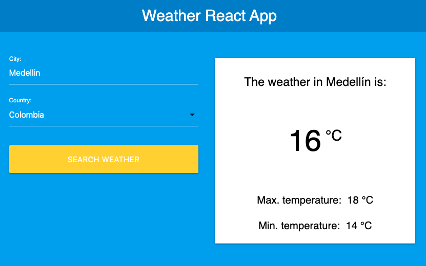

  <h1> 🌩️🌧️ ⛅ ☀️   React Weather App    ☀️⛅🌧️🌩️  </h1>
  
React app to verify the weather on your city

    
  
   
   
  
Final result

  
<strong>https://david-portilla.github.io/weather/</strong>

   

## Features

- [x] API rest
- [x] React hooks
- [x] Materialize
- [x] Styled component

# Weather App

React app to check the weather using Open Weather Map API
https://openweathermap.org/

## Instructions

Type your city and select the country from the select.

## Available Scripts

In the project directory, you can run:

### `npm start`

Runs the app in the development mode.\
Open [http://localhost:3000](http://localhost:3000) to view it in the browser.

The page will reload if you make edits.\
You will also see any lint errors in the console.
